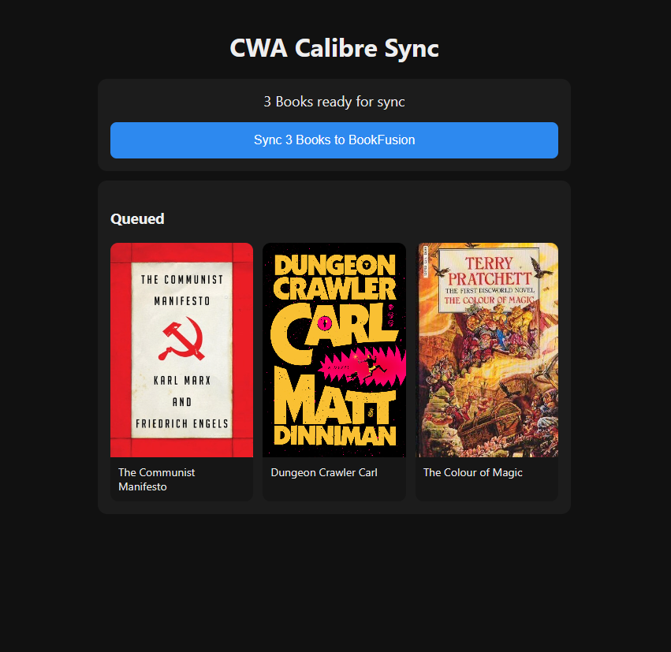

# bookfusion-sync

Sync tagged ebooks from Calibre-Web-Automated to BookFusion with a simple web UI.

## Screenshot



## What it does

- Reads books tagged `bf` from your Calibre library database (`metadata.db`)
- Uploads ebook files to BookFusion via API
- Removes the `bf` tag after successful upload
- Provides a minimal UI to trigger sync and view results

## Requirements

- Docker / Docker Compose
- A Calibre library folder mounted into the container
- BookFusion API key

## Environment variables

- `APP_PORT` (default: `8090`)
- `CALIBRE_LIBRARY_DIR` (default: `/calibre-library`)
- `BOOKFUSION_API_KEY` (required)
- `BOOKFUSION_API_BASE` (default: `https://www.bookfusion.com/calibre-api/v1`)
- `SECRET_KEY` (recommended; use a stable random value for CSRF/session consistency)

## Docker Compose example

```yaml
services:
  bookfusion-sync:
    build: ./bookfusion-sync
    container_name: bookfusion-sync
    environment:
      - APP_PORT=8090
      - CALIBRE_LIBRARY_DIR=/calibre-library
      - BOOKFUSION_API_KEY=${BOOKFUSION_API_KEY}
      - BOOKFUSION_API_BASE=https://www.bookfusion.com/calibre-api/v1
      - SECRET_KEY=${BOOKFUSION_SECRET_KEY}
    volumes:
      - /path/to/your/calibre-library:/calibre-library
    ports:
      - "8090:8090"
    restart: unless-stopped
```

## Run

```bash
docker compose up -d --build bookfusion-sync
```

Then open:

- `http://<your-host>:8090`

## How to use

1. In Calibre/Calibre-Web, add tag `bf` to books you want synced.
2. Open the app UI.
3. Click **Sync ... to BookFusion**.
4. Check results and confirm books appear in BookFusion.

## Security notes

- Do not commit real API keys or secret keys.
- Keep `SECRET_KEY` stable across restarts to avoid CSRF/session issues.
